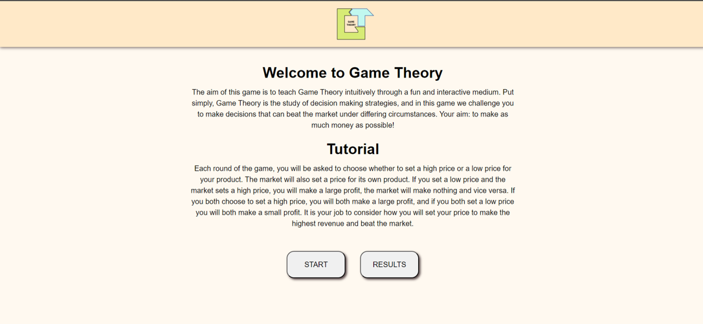
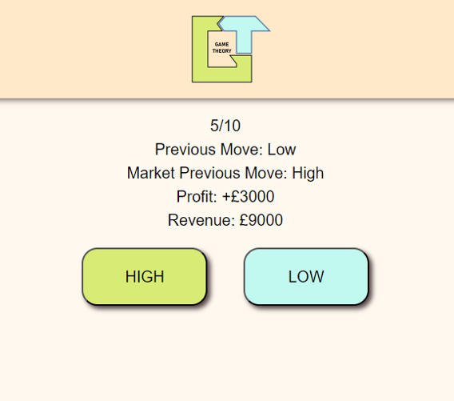

# Game of Theory

An App aimed at creating interest in Game Theory and Economics in year 9 students

## Table of contents
### [Description](#description-1)
### [User Story](#user-story-1)
### [Acceptance Criteria](#acceptance-criteria-1)
### [Screen Shots](#screen-shots-1)
### [Installation](#installation-1)
### [Credits](#credits-1)
### [License](#license-1)

## Description

You are playing a game called 'The Prisoner's Dilemma'. Choose High or Low - it's a free choice - and you get ten rounds per game. The App makes a free choice and is unaware of the choice you make.

And it's as simple as that.

So why have so many economic papers been written about such a simple game?

The scoring is not simple.

The top score comes if you choose Low and the App choses High.
The next best is if you both choose High.
3rd best if you bot choose Low.
And the lowest score comes from you choosing High with the App choosing Low.

The App doesn't know what you will choose next, but it might make a prediction, and that prediction may be based on your previous choices; so choose carefully.

You will be taken to the results page at the end of each game, you can look over past games, and delete any results you can't bear to look at.

About the Project
- This project makes good use of the concepts we have covered so far on the course such as wireframes, working methodologies, logical reasoning, and programming fundamentals.
- We used version control & worked in an Agile manner!

## User Story

```
AS A year 9 student with limited experience or interest of non-STEM subjects
I WANT to play an engaging game
SO THAT I can explore game-theory and economics without being bored
```

## Acceptance Criteria

- Our repo README follow the guidance [Writing READMEs guide](https://github.com/getfutureproof/fp_guides_wiki/wiki/Writing-READMEs) for details.
- Our project has a front-end and a back-end.

## Screen Shots
### Home Page 

### Gameplay Page 

### Results Page 

## Installation

This is a basic static front-end website deployment which can be deployed on any server or client with a browser.

Clone the repo and install with npm install.

To run the server, change the server fetch path in both:
- function resultDeleteGameData in results.js
- function postObject in gameplay.js
 to your chosen deploy server or localhost:xxxx setting the port in the .env file.

## Technologies Used


## Credits
Ralph Cox, Camille Francis, Emre Duzgun, Alex Slater

## License

This work is published under the [MIT Licence](./LICENSE)
